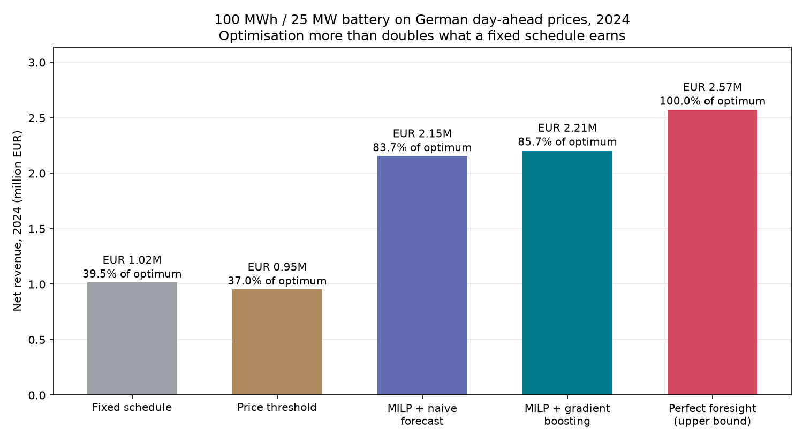
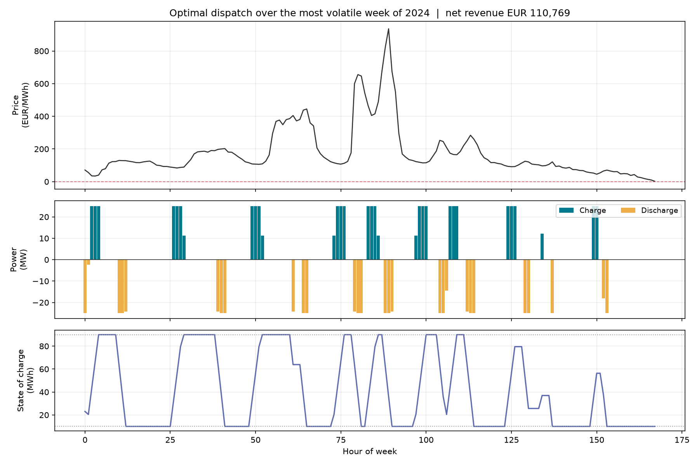
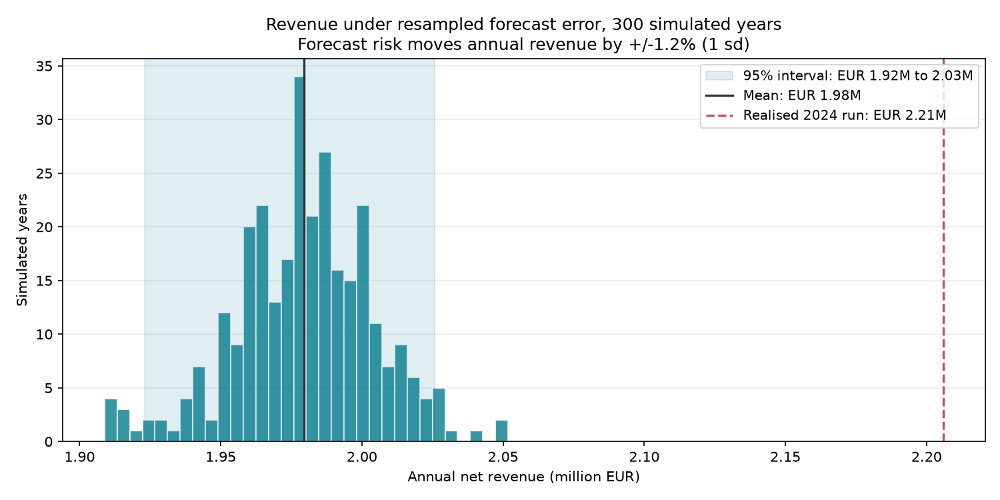

# Battery dispatch optimisation on real electricity prices

[](https://github.com/JosElias23/battery-dispatch-optimizer/actions/workflows/ci.yml)
[](https://github.com/JosElias23/battery-dispatch-optimizer/actions/workflows/ci.yml)
[](pyproject.toml)
[](LICENSE)

How much is a grid battery worth, and how much of that value can you actually
capture without knowing tomorrow's prices?

A 100 MWh / 25 MW storage asset is dispatched against German day-ahead prices
for all of 2024 using mixed-integer optimisation over forecast prices, and
scored against the perfect-foresight upper bound, the most any operator could
possibly have earned.

---

## Results

Net revenue over 2024 (8,784 hours), after round-trip losses and degradation.

| Policy | Net revenue | Capture rate | Cycles/day |
|---|---:|---:|---:|
| Fixed schedule (charge at night, sell at peak) | € 1,015,207 | 39.5 % | 0.93 |
| Price threshold (quantile rule) | € 951,999 | 37.0 % | 0.67 |
| MILP + seasonal-naive forecast | € 2,154,597 | 83.7 % | 1.42 |
| **MILP + gradient-boosted forecast** | **€ 2,205,860** | **85.7 %** | 1.50 |
| _Perfect foresight (theoretical bound)_ | _€ 2,573,659_ | _100 %_ | 1.45 |



**The headline: optimisation against a forecast captures 85.7 % of what a
clairvoyant operator could have earned, and earns € 1.19 M more than a fixed
schedule, 2.17× the revenue, from the same physical asset.**

The capture rate, not the euro figure, is the number worth quoting. Absolute
revenue depends entirely on how volatile the year happened to be; the fraction
of the attainable optimum is comparable across markets and years.

Every number here is produced by `scripts/run_experiment.py` and stored in
[`reports/metrics_dispatch.json`](reports/metrics_dispatch.json). Nothing in
this README is typed by hand.

### What the optimiser actually does



The most volatile week of 2024. Prices peak at 936 €/MWh; the battery cycles
between its 10 % and 90 % state-of-charge limits, buying in the troughs and
selling into the spikes, and clears € 110,769 in seven days.

---

## Five findings

### 1. A forecast that is better on average is not automatically worth more money

| Forecaster | MAE (€/MWh) | RMSE (€/MWh) | Revenue | Capture |
|---|---:|---:|---:|---:|
| Seasonal naive (same hour, last week) | 32.31 | 54.78 | € 2,154,597 | 83.7 % |
| Gradient boosting | **28.36** | **43.94** | **€ 2,205,860** | **85.7 %** |

A 12 % reduction in MAE buys 2.0 percentage points of capture rate, real, but
far from proportional. Dispatch does not need accurate prices; it needs the
*ordering* of cheap and expensive hours. Getting the level of a flat afternoon
wrong costs nothing. Getting the position of the evening peak wrong costs a full
cycle.

The intermediate result makes the point sharper. An earlier version of the
booster had a *worse* MAE than the naive baseline (25.97 vs 24.77 on a two-month
slice) yet the fix that mattered lifted capture from 44.5 % to 55.1 % on that
same slice while barely moving MAE at all. **Forecast error is a proxy metric.
Revenue is the objective.** Both are reported here; they disagree.

### 2. Training on price *levels* broke the model, and centring fixed it

The first gradient booster was trained to predict the price directly. It learned
2023, where prices averaged 95.18 €/MWh. It was evaluated on 2024, which cleared
at 78.51 €/MWh, 17 €/MWh lower. Every notion of "cheap" it had learned sat in
the wrong place, and it lost to a naive weekly lag.

The fix was to predict the *deviation from a trailing 168-hour price level*
rather than the level itself, with the lagged features centred on the same
anchor. The daily and weekly **shape** of electricity prices is stable across
years; the absolute level is not, and the level is what moved.

This is a distribution shift a train/test split on a single year would never
have exposed. It is only visible because the split is across years, which is the
only split that reflects how the model would actually be deployed.

### 3. The constraint everyone calls redundant is not, but it is cheap, not lucrative

Textbook formulations often drop the binary forbidding simultaneous charge and
discharge, arguing that doing both at once is never optimal, so the linear
relaxation is exact and much faster.

That argument assumes positive prices. 457 hours of 2024, 5.2 % of the year,
cleared **below zero**, and there the operator is *paid* to consume. The relaxed
model then discovers it can hold the state of charge flat while maintaining a
net import:

```
hold SoC:   eta_c * charge = discharge / eta_d
net grid:   discharge - charge = charge * (eta_rt - 1) < 0
```

The round-trip loss becomes a way to absorb paid-for energy indefinitely,
without ever filling the battery. Running `scripts/ablate_complementarity.py`:

| | With constraint | Without |
|---|---:|---:|
| Net revenue | € 2,573,659 | € 2,574,867 |
| Hours charging and discharging at once | 0 | **28** |
| ...of which at negative prices | — | **28 (100 %)** |
| Physically impossible hours | 0 | 28 |

The most extreme case charges at 25 MW while discharging 11.8 MW at −85.08
€/MWh.

The honest conclusion is about correctness, not money. Every single one of the
28 impossible hours occurs at a negative price, exactly as the mechanism
predicts. But the invented revenue is € 1,209, or **0.05 %**. The relaxation
produces a physically impossible schedule and is barely richer for it.

Nor is the relaxation the dramatic speed-up the textbook argument implies:
solving the full year takes 4.43 s with the binary and 2.80 s without, a factor
of 1.6. Modern branch-and-bound handles this structure well.

So: keep the binary. It costs 1.6 s a year and it is the difference between a
schedule an asset could execute and one it could not.

### 4. Reaching the last 14 % is a forecasting problem, not an optimisation one

The MILP is optimal for the prices it is given. The 14.3 % gap to perfect
foresight is entirely attributable to forecast error, every euro of it. No
improvement to the solver, the formulation or the horizon can recover any of it.
That is a useful thing to know before investing engineering effort, and it is
only visible because the upper bound was computed.

### 5. Revenue is remarkably insensitive to *when* forecast errors land



300 simulated years, each built by resampling the observed 2024 forecast errors
in day-long blocks and re-running the full rolling-horizon dispatch:

| | |
|---|---:|
| Mean annual revenue | € 1,979,567 |
| Standard deviation | € 24,533 |
| 95 % interval | € 1,923,083 – € 2,025,870 |
| **Relative spread (1 sd)** | **1.24 % of mean** |

A ±1.24 % band is narrow. Given a forecaster of this quality, the *timing* of
its mistakes barely matters: bad luck in when errors fall costs about € 25,000
on € 2 M. For an asset owner, that is the difference between a revenue model
worth underwriting and one that is not.

**The realised run beat the simulation, and that needs explaining rather than
celebrating.** The actual gradient-boosting dispatch earned € 2,205,860, above
the 95 % interval. Either it was lucky, or the simulation is pessimistic by
construction. `scripts/analyse_forecast_error.py` tests the second hypothesis:

| Forecast | MAE (€/MWh) | Mean within-day rank correlation |
|---|---:|---:|
| Real gradient boosting | 28.36 | **0.7757** |
| Block-bootstrapped | 28.22 | **0.7266** (sd 0.0119) |

Same error magnitude, materially worse ranking. Block resampling preserves how
*big* the errors are and how they cluster in time, but detaches them from the
prices they were made against. An error block from a volatile December week
pasted onto a calm July day is a forecast no model would ever have produced.

And dispatch value lives entirely in the ranking, not the level: a forecast
uniformly 30 €/MWh too high loses nothing at all, because the optimiser still
buys in the same hours. So the Monte Carlo is a **conservative bound**, and the
realised result is structure the bootstrap deliberately discards, not luck.

This is finding 1 arriving by a second, independent route. Two different
experiments, the same conclusion: *for storage dispatch, ordering is the metric
and error magnitude is a decoy.*

One honest complication surfaced along the way. The forecaster is **worse**
exactly where the money is: mean absolute error is 27.63 €/MWh in the calmest
quartile of hours against 34.18 €/MWh in the most volatile, 1.24× higher,
correlation 0.36 with local volatility. Volatile hours are where the spreads
are. Improving the forecast specifically in those hours is the single most
promising route to closing the remaining 14 % gap.

Why each of these decisions was made, and what the alternatives cost, is
written up in [`docs/DECISIONS.md`](docs/DECISIONS.md).

---

## The problem

A battery earns money by buying electricity when it is cheap and selling it when
it is expensive. Three things make that harder than it sounds:

- **Round-trip losses.** At 86 % efficiency, delivering 1 MWh to the grid
  requires drawing 1.163 MWh from it. Buying at 100 €/MWh means the sell price
  must clear 119.28 €/MWh, including degradation, just to break even.
- **Degradation.** Cycling wears the cells. Without a cost on throughput the
  optimiser trades every small wiggle, which is profitable on paper and destroys
  the asset in reality.
- **Uncertainty.** Tomorrow's prices are not known when today's plan is made.

The physical model, the sign conventions and the economics are in
[`src/battery/model.py`](src/battery/model.py).

## The data

German/Luxembourg day-ahead auction prices via the
[energy-charts](https://api.energy-charts.info) API (Fraunhofer ISE),
republishing Bundesnetzagentur/SMARD data under **CC BY 4.0**. No API key, no
registration.

| | 2023 (training) | 2024 (evaluation) |
|---|---:|---:|
| Hours | 8,760 | 8,784 |
| Mean price | 95.18 €/MWh | 78.51 €/MWh |
| Std. deviation | 47.58 €/MWh | 52.72 €/MWh |
| Range | −500.00 to 524.27 | −135.45 to 936.28 |
| Negative-price hours | 301 (3.44 %) | **457 (5.20 %)** |
| Mean daily spread | 98.13 €/MWh | 111.47 €/MWh |

The forecasters are fitted on 2023 and never see 2024. That daily spread is the
raw arbitrage opportunity: no round trip can earn more than the spread of the
day it happens in.

> **Why Germany and not Chile.** Chile's Coordinador Eléctrico Nacional API
> requires a registered key (`Authentication parameters missing`), and the CNE
> open-data portal was unreachable during development. Requiring a credential
> would break the guarantee that anyone can clone this repository and reproduce
> every number. Germany is also the better test case: very high renewable
> penetration produces the volatility and the negative prices that make storage
> arbitrage interesting at all. `src/battery/data.py` isolates all network
> access behind one function, so adding a Chilean adapter means writing one
> class and changing nothing else.

## Method

### Mixed-integer formulation

Per hour `t`, with prices `p[t]`:

```
maximise   sum_t  p[t] * (d[t] - c[t]) * dt  -  k_deg * sum_t d[t] * dt

subject to s[t] = s[t-1] + eta_c * c[t] * dt - d[t] * dt / eta_d   (energy balance)
           0 <= c[t] <= P * y[t]                                   (charge power)
           0 <= d[t] <= P * (1 - y[t])                             (discharge power)
           SoC_min <= s[t] <= SoC_max                              (usable band)
           y[t] in {0, 1}                                          (one direction only)
```

Solved with HiGHS through PuLP, falling back to the bundled CBC so the
repository runs with no extra system dependencies. The full year solves in about
5 seconds.

### Rolling horizon

A real operator does not solve the year in one shot. Each day the model plans 48
hours ahead on forecast prices and **commits only the first 24**, then re-plans
tomorrow.

Committing less than the planning horizon is what stops the schedule collapsing
at the window edge: energy left in the battery at the end of a window is worth
nothing *inside* that window, so a model that commits everything it plans
empties the battery every night regardless of tomorrow's prices. The discarded
second day absorbs the end effect.

Plans are made on forecast prices; **revenue is always booked at realised
prices.** Scoring a forecast-driven plan against the forecast that produced it
measures nothing but the optimiser's arithmetic.

### Preventing temporal leakage

The furthest hour being decided is 48 hours away, so **no feature may reference
anything within 48 hours of its target**. This rules out the single strongest
predictor available, yesterday's price at the same hour, and
`src/battery/forecast.py` raises on any lag shorter than 48.

That guard immediately caught a lag of 24 left in the config from an early
draft. It would have produced a better forecast, a better capture rate, and
revenue that could never have been earned.

`tests/test_forecast.py` goes further: it overwrites the second half of the
price series with garbage and asserts that every prediction in the first half is
bit-for-bit unchanged. Any feature reaching forward in time fails it.

### Verifying the solver

`check_feasibility` re-derives the state of charge from a schedule and re-checks
every physical limit, independently of the solver. A solver reporting `Optimal`
means only that it satisfied the constraints it was handed; if those were
written incorrectly the answer is optimal for the wrong problem, and the mistake
surfaces as revenue rather than as an error. Every dispatch in the results table
passes this check before its revenue is recorded.

---

## Reproducing these numbers

```bash
git clone https://github.com/JosElias23/battery-dispatch-optimizer.git
cd battery-dispatch-optimizer
python -m venv .venv && source .venv/bin/activate   # Windows: .venv\Scripts\activate
pip install -e ".[dev]"
```

```bash
python -m pytest
```

66 tests covering battery physics, MILP optimality against hand-computed cases,
and forecast leakage.

```bash
python scripts/run_experiment.py
```

Downloads and caches the price data, fits the forecasters on 2023, dispatches
2024 under every policy, and writes `reports/metrics_dispatch.json`. About one
minute.

```bash
python scripts/ablate_complementarity.py
python scripts/analyse_forecast_error.py
python scripts/make_figures.py
```

The Monte Carlo is the expensive step: one simulated year is 366 sequential MILP
solves, so 300 draws take roughly an hour spread across 12 processes.

```bash
python scripts/run_monte_carlo.py --workers 12
```

Or run `make all` for the whole pipeline.

---

## Repository layout

```
battery-dispatch-optimizer/
├── configs/default.yaml          every parameter that moves a reported number
├── src/battery/
│   ├── model.py                  physics, economics, independent feasibility check
│   ├── optimize.py               MILP and the perfect-foresight bound
│   ├── policies.py               rule-based baselines and the shared simulator
│   ├── forecast.py               forecasters with the 48-hour leakage blackout
│   ├── simulate.py               rolling horizon and Monte Carlo
│   ├── data.py                   price download, caching and validation
│   └── utils.py                  seeding, config, JSON reporting
├── scripts/
│   ├── run_experiment.py         the main experiment
│   ├── run_monte_carlo.py        revenue distribution under forecast error
│   ├── ablate_complementarity.py the money-pump ablation
│   ├── analyse_forecast_error.py why the Monte Carlo is a conservative bound
│   └── make_figures.py           every figure in this README
├── tests/                        66 tests
└── reports/                      metrics as JSON, figures as PNG
```

---

## Limitations and next steps

**Day-ahead prices are published before the day starts.** In the real German
market the auction clears around 12:45 on D−1 and publishes all 24 prices for
day D, so an operator planning *within* the delivery day genuinely does have
near-perfect foresight. The forecasting problem modelled here is the one faced
when **bidding into** the auction before it clears, and the 48-hour blackout is
a deliberately conservative version of it. A desk bidding at noon on D−1 faces a
12-to-36-hour horizon, not 48. A shorter blackout would raise every capture rate
reported above. The relative ranking of the policies would not change.

**One year, one market, one battery configuration.** All results are 2024
**Germany with a 4-hour battery.** Capture rates depend on the volatility of the
year, the duration of the asset, and the market's structure. Nothing here has
been tested on Chilean data.

**Revenue is arbitrage only.** Real storage assets earn a large share of their
income from frequency response and capacity markets, which are not modelled. The
figures are a lower bound on total asset value and should not be read as a
business case.

**Degradation is linear in throughput.** Actual cell ageing depends on depth of
discharge, temperature, C-rate and calendar time. A linear cost per MWh is the
standard tractable approximation and keeps the problem an LP-representable MILP,
but it will misprice deep cycles.

**The battery starts half full.** That 50 MWh endowment can be sold without ever
having been bought. Over a year it is worth roughly 0.1 % of revenue and it
applies to every policy alike, so comparisons are unaffected, but the absolute
figures are very slightly flattered.

**Perfect foresight is solved in fortnight chunks**, chained through the state
of charge, rather than as one 8,784-hour MILP. This can only *understate* the
true optimum, it forbids arbitrage across chunk boundaries, so the reported
capture rates are, if anything, slightly generous.

**No hyperparameter search.** The booster uses standard values applied without
tuning. Fair as a comparison, almost certainly not optimal.

**The Monte Carlo models error timing, not error size.** It resamples the errors
the fitted model actually made, so it answers "what if these mistakes had fallen
elsewhere in the year", not "what if the forecaster were worse". A
forecaster-quality sensitivity, scaling error magnitude up and down, would
answer the second question and is not done here.

### Planned

- Chilean market adapter, once a Coordinador API key is available
- Stochastic (scenario-based) optimisation instead of point forecasts, which
  should recover part of the remaining 14 % gap
- Frequency-response revenue stacked on top of arbitrage
- Sensitivity of capture rate to battery duration (2 h, 4 h, 8 h)

---

## License

**MIT, see [LICENSE](LICENSE).** Price data is Bundesnetzagentur/SMARD via
Fraunhofer ISE energy-charts, licensed CC BY 4.0.